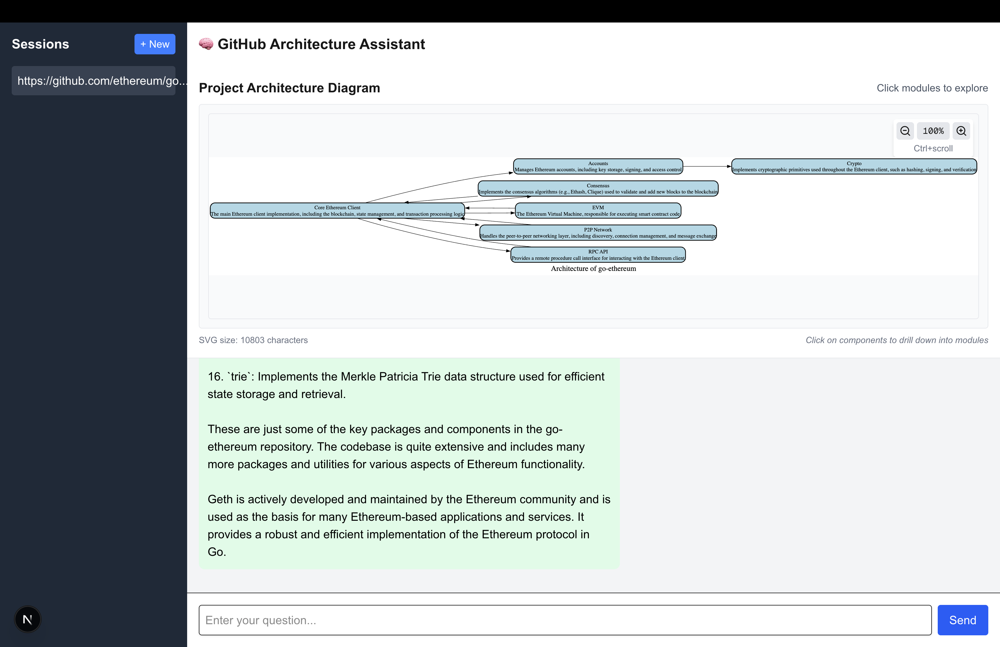
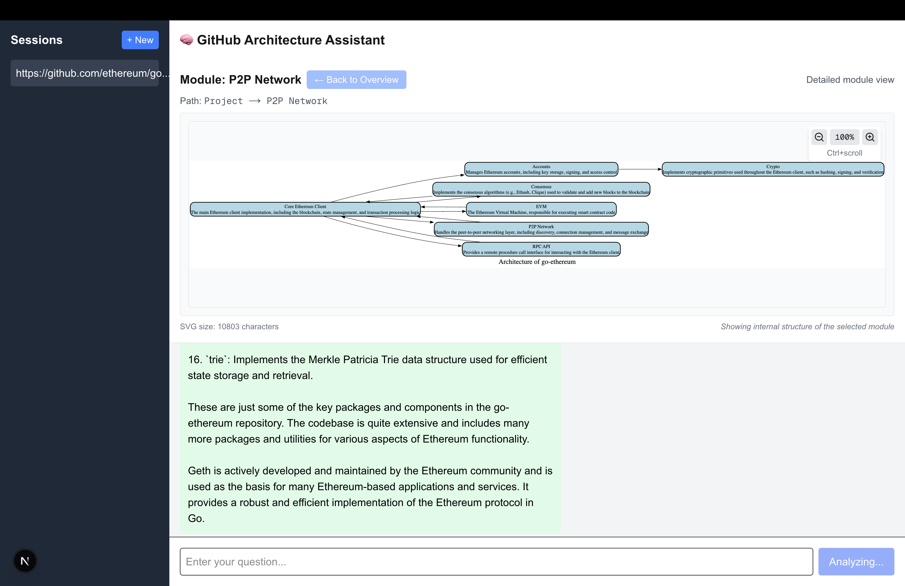

# LLM Code Architecture Visualizer

This project provides a web application that allows users to input a GitHub repository link and automatically generates interactive, hierarchical architecture diagrams for the code project. Users can explore the codebase at different levels of detail and ask questions through an intelligent chat interface.

## Features

### 🏗️ **Hierarchical Architecture Visualization**
- **Multi-Level Exploration**: Start with a high-level overview, then drill down into specific modules
- **Clickable Components**: Click on any module in the overview diagram to explore its internal architecture
- **Navigation Controls**: Easy back button and breadcrumb navigation to move between levels
- **Smart Module Analysis**: AI-powered analysis of internal module structure and relationships

### 🔍 **Advanced Zoom & Navigation**
- **Content-Aware Zoom**: Zoom in/out on diagram content with proper scaling (30% - 300%)
- **Multiple Zoom Methods**: 
  - Zoom buttons with visual feedback
  - Mouse wheel zoom (Ctrl/Cmd + scroll)
  - One-click reset to 100%
- **Smooth Interactions**: Animated transitions and scrollable containers for large diagrams

### 🤖 **Intelligent Analysis**
- **GitHub Repository Analysis**: Automatically clones and analyzes repository structure
- **AI-Powered Insights**: Uses Claude LLM to identify key architectural components and relationships
- **Interactive Q&A**: Chat with the LLM about the codebase to understand its architecture
- **Context-Aware Responses**: Different analysis depth based on current view level

### 🎨 **Modern Interface**
- **Responsive Design**: Clean, intuitive web interface built with Next.js and Tailwind CSS
- **Session Management**: Multiple chat sessions with persistent architecture exploration
- **Visual Feedback**: Clear indicators for current level, navigation path, and interaction hints

## Project Structure

The project consists of two main components:
- **llm-backend**: The backend implementation of the project (Python/FastAPI)
- **llm-frontend**: The frontend implementation of the project (Next.js)

## Screenshots

### Application Interface

### Enter Github Link

### Architecture Diagram Example

### Click P2P Network Module

### P2P Network Example


## Setup and Installation

### Backend Setup (llm-backend)

1. Navigate to the backend directory:
   ```
   cd llm-backend
   ```

2. Install required dependencies:
   ```
   pip install -r requirements.txt
   ```

   Required packages:
   - fastapi
   - uvicorn
   - anthropic
   - python-dotenv
   - graphviz
   - requests
   - pydantic
   - gitpython

3. Configure your environment variables:
   - Add your API key to the `.env` file:
     ```
     ANTHROPIC_API_KEY=your_api_key_here
     ```

4. Start the backend server:
   ```
   uvicorn main:app --reload
   ```

### Frontend Setup (llm-frontend)

1. Navigate to the frontend directory:
   ```
   cd llm-frontend
   ```

2. Install required dependencies:
   ```
   npm install
   ```

   Key dependencies:
   - next
   - react
   - react-dom
   - uuid
   - tailwindcss

3. Start the development server:
   ```
   npm run dev
   ```

4. Open your browser and navigate to `http://localhost:3000` (or the port shown in your terminal)

## Usage

### Basic Workflow

1. **Start Analysis**: Enter a GitHub repository URL in the input field
2. **Explore Overview**: The application generates a high-level architecture diagram showing main modules
3. **Drill Down**: Click on any module box to explore its internal structure and components
4. **Navigate**: Use the back button or breadcrumb navigation to return to previous levels
5. **Chat & Learn**: Ask questions about the codebase through the intelligent chat interface

### Diagram Interaction

#### **Hierarchical Navigation**
- **Overview Level**: Shows 5-8 main architectural components and their relationships
- **Module Level**: Displays internal structure, subcomponents, and functions within a selected module
- **Clickable Elements**: Module boxes in overview diagrams are clickable (indicated by hover effects)
- **Navigation Path**: Breadcrumb showing current location (e.g., "Project → Backend → Services")

#### **Zoom Controls**
- **Zoom In/Out**: Use the `+` and `-` buttons in the top-right corner
- **Mouse Wheel**: Hold `Ctrl` (or `Cmd` on Mac) + scroll for precise zoom control
- **Reset Zoom**: Click the percentage button (e.g., "150%") to return to 100%
- **Zoom Range**: Scale between 30% and 300% for optimal viewing
- **Scroll Navigation**: When zoomed in, scroll within the diagram area to explore different sections

#### **Visual Indicators**
- **Current Level**: Header shows "Project Architecture Diagram" or "Module: [Name]"
- **Navigation Hints**: Instructions like "Click modules to explore" or "Detailed module view"
- **Interactive Elements**: Hover effects on clickable components
- **Loading States**: Visual feedback during analysis and diagram generation

### Tips for Best Experience

1. **Start Broad**: Begin with the overview to understand the overall architecture
2. **Focus Deep**: Click on modules you're most interested in for detailed analysis
3. **Use Zoom**: Zoom in on complex diagrams to see details clearly
4. **Ask Questions**: Use the chat to get explanations about specific components or relationships
5. **Multiple Sessions**: Create new sessions to compare different repositories

## Technical Architecture

### Backend Architecture (llm-backend)

The backend has been enhanced with hierarchical analysis capabilities:

- **Multi-Level Analysis**: Support for both overview and module-specific analysis
- **Smart Component Detection**: LLM-powered identification of architectural components
- **Clickable SVG Generation**: Dynamic generation of interactive diagrams with JavaScript hooks
- **Navigation State Management**: API support for drill-down requests and navigation paths

#### Key Components

- **main.py**: FastAPI application with enhanced `/analyze` endpoint supporting drill-down
- **service/github_analyzer.py**: Repository cloning and structure analysis
- **service/graph_builder.py**: 
  - `generate_architecture_svg()`: Creates overview diagrams with clickable elements
  - `generate_module_architecture_svg()`: Generates detailed module diagrams
  - `analyze_module_with_llm()`: AI-powered module analysis
- **service/llm_client.py**: Claude API integration with context-aware prompts
- **schema.py**: Enhanced request/response models with navigation support

#### API Enhancements

The `/analyze` endpoint now supports:
```json
{
  "github_link": "https://github.com/user/repo",
  "history": [...],
  "drill_down_module": "module_name",  // For module-specific analysis
  "current_path": ["path", "to", "module"],  // Navigation breadcrumb
  "force_initial": false
}
```

Response includes:
```json
{
  "text": "Analysis text...",
  "svg": "<svg>...</svg>",
  "level": "overview|module",
  "current_module": "module_name",
  "navigation_path": ["path", "to", "current"]
}
```

### Frontend Architecture (llm-frontend)

The frontend implements sophisticated state management for hierarchical navigation:

- **Navigation State**: Tracks current level, module, and breadcrumb path
- **Interactive SVG**: Handles clicks on diagram elements to trigger drill-down
- **Zoom Management**: Advanced zoom controls with transform-based scaling
- **Session Persistence**: Maintains navigation state across chat sessions

#### Key Features

- **Global Function Binding**: `window.drillDown()` for SVG click handling
- **Smooth Transitions**: CSS transforms with easing for zoom operations
- **Responsive Design**: Adaptive layout for different diagram sizes
- **Error Handling**: Graceful fallbacks for analysis failures

